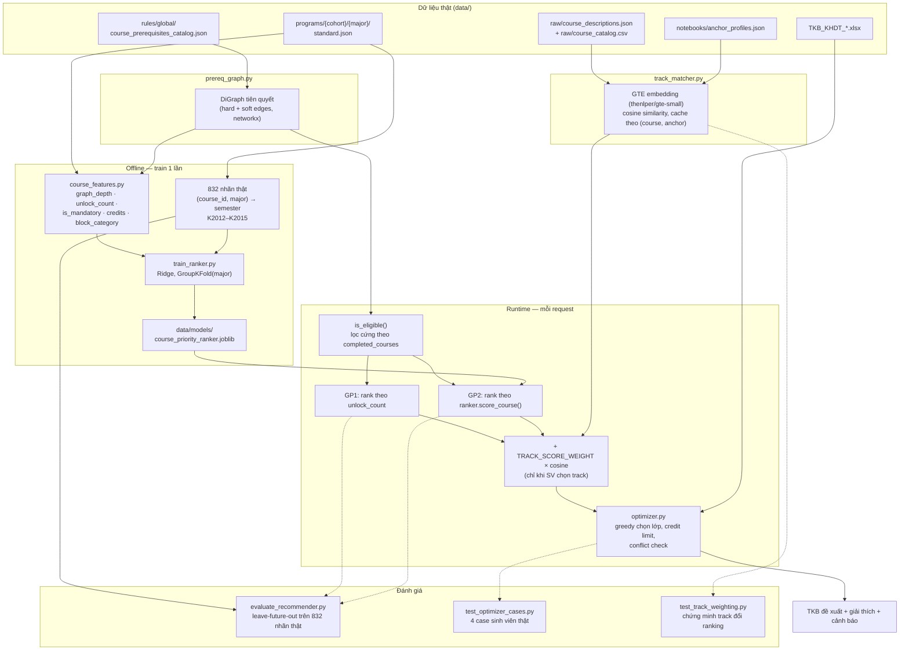

# Báo cáo Đồ án — Hệ thống Hỗ trợ Lập lộ trình Học tập & Đăng ký Môn học

**Môn học:** Data-Driven Systems (DDS)
**Trường:** Đại học Công nghệ Thông tin — ĐHQG TP.HCM (UIT)
**Nhóm:** 13 — Đinh Minh Tuấn (250201097); Nguyễn Hải Đăng (250201047) | GVHD: Lê Thanh Tùng
**Branch triển khai:** `dangnh`
**Ngày cập nhật:** 2026-07-25

---

## Tóm tắt

Đồ án xây dựng một **hệ thống hỗ trợ ra quyết định** (Decision Support System) giúp sinh viên UIT chọn môn học đăng ký cho học kỳ tới. Hệ thống nhận hồ sơ sinh viên (ngành, khóa, các môn đã hoàn thành) và danh sách lớp học phần **thực tế đang mở** của một học kỳ cụ thể, rồi đề xuất tổ hợp lớp nên đăng ký — đảm bảo tuân thủ 100% điều kiện tiên quyết và ràng buộc tín chỉ, có giải thích cho từng đề xuất, và có thể cá nhân hóa theo định hướng chuyên ngành.

Điểm khác biệt cốt lõi của đồ án so với một bộ lọc if-else đơn thuần: có **hai giải pháp (GP) được xây dựng và so sánh định lượng** —

- **GP1 — Luật & Đồ thị:** xây đồ thị tiên quyết từ dữ liệu quy định thật của trường, xếp hạng môn theo cấu trúc đồ thị (critical path / unlock-count).
- **GP2 — Học máy:** một mô hình hồi quy tuyến tính (Ridge) **được huấn luyện thật** trên 832 nhãn "môn học → học kỳ dự kiến" — dữ liệu có thật do trường công bố (khung chương trình đào tạo K2012–K2015), không phải dữ liệu tổng hợp (synthetic) và không cần bảng điểm sinh viên thật (vốn bị giới hạn bởi NDA).

Cả hai được đánh giá bằng phương pháp **leave-future-out** trên chính 832 nhãn thật đó — không cần thu thập thêm dữ liệu, không cần người dùng thử nghiệm thật. Kết quả: GP2 vượt GP1 trên cả Precision@5 và Recall@5 ở phần lớn các ngành (macro P@5 0.658 so với 0.620).

Ngoài ra, hệ thống có một lớp cá nhân hóa bổ sung (**track-weighting**) dùng embedding ngữ nghĩa (GTE, cùng hướng tiếp cận với hệ thống Scholar Inbox — ACL 2025) để ưu tiên môn học theo định hướng chuyên ngành sinh viên chọn (ví dụ "Thị giác máy tính" trong ngành Khoa học Máy tính), phủ đủ 12/12 ngành đào tạo hiện có.

---

## Mục lục

1. [Bối cảnh & Bài toán](#1-bối-cảnh--bài-toán)
2. [Phạm vi dữ liệu](#2-phạm-vi-dữ-liệu)
3. [Input / Output](#3-input--output)
4. [Kiến trúc hệ thống](#4-kiến-trúc-hệ-thống)
5. [Phương pháp luận](#5-phương-pháp-luận)
6. [Pipeline dữ liệu](#6-pipeline-dữ-liệu)
7. [Đánh giá & Kết quả](#7-đánh-giá--kết-quả) (gồm 7.7 [Phân tích kết quả](#77-phân-tích--diễn-giải-kết-quả))
8. [Lỗi dữ liệu phát hiện & đã sửa](#8-lỗi-dữ-liệu-phát-hiện--đã-sửa)
9. [Sản phẩm & Demo](#9-sản-phẩm--demo)
10. [Xác thực (Verification)](#10-xác-thực-verification)
11. [Hạn chế & Hướng phát triển](#11-hạn-chế--hướng-phát-triển)
12. [Tổng kết](#12-tổng-kết)
13. [Tham khảo](#13-tham-khảo)
14. [Phụ lục](#14-phụ-lục)

---

## 1. Bối cảnh & Bài toán

### 1.1 Bối cảnh

Sinh viên hệ tín chỉ tại UIT tự chọn lộ trình học nhưng thường gặp khó khăn:

- **Ràng buộc chương trình phức tạp**: môn tiên quyết, môn học trước, môn song hành chằng chịt — sắp xếp sai thứ tự dẫn tới trễ tiến độ tốt nghiệp.
- **Đăng ký theo cảm tính**: thiếu công cụ hỗ trợ tính toán, dễ đăng ký thiếu/thừa tín chỉ hoặc bỏ sót môn quan trọng.
- **Cố vấn học tập quá tải**: một CVHT quản lý hàng trăm sinh viên, khó tư vấn cá nhân hóa cho từng trường hợp.
- **Không có dữ liệu bảng điểm sinh viên thật để khai thác** — dữ liệu học vụ cá nhân bị giới hạn bởi NDA, không thể thu thập cho mục đích đồ án.

### 1.2 Phát biểu bài toán

> Cho một sinh viên cụ thể (ngành, khóa, danh sách môn đã hoàn thành) tại một học kỳ cụ thể (có danh sách lớp học phần thực tế đang mở), hệ thống đề xuất **tổ hợp lớp học phần cụ thể** nên đăng ký — tối ưu theo tiến độ tốt nghiệp, đảm bảo tuân thủ 100% quy chế, và giải thích được lý do đề xuất.

Bài toán được tách thành 2 quyết định con, xử lý bởi 2 tầng riêng biệt (xem mục 4):

1. **Chọn môn** (What) — môn nào nên học kỳ này, ưu tiên theo thứ tự nào.
2. **Chọn lớp** (How) — trong các môn đã chọn, đăng ký lớp cụ thể nào để không trùng lịch và đúng ràng buộc tín chỉ.

### 1.3 Ràng buộc thiết kế

Ba nguyên tắc được giữ xuyên suốt quá trình xây dựng đồ án, ảnh hưởng trực tiếp tới lựa chọn phương pháp:

| Nguyên tắc | Lý do | Hệ quả thiết kế |
|---|---|---|
| Không dùng bảng điểm sinh viên thật | Bị giới hạn bởi NDA, không thể thu thập | Không có nhãn "sinh viên X học môn Y đạt điểm Z" |
| Không dùng dữ liệu tổng hợp (synthetic) cho việc huấn luyện/đánh giá | Tránh việc "tự chấm bài mình" — ground truth phải độc lập với hệ thống | Nhãn huấn luyện GP2 phải là dữ liệu **thật, có thẩm quyền** |
| Toàn bộ hệ thống phải giải thích được (explainable) | Đây là hệ thống *hỗ trợ quyết định*, không phải hộp đen | Ưu tiên mô hình tuyến tính (Ridge) thay vì mô hình phức tạp hơn dù có thể đánh đổi một phần độ chính xác |

Giải pháp cho ràng buộc "không synthetic, không bảng điểm SV thật" là dùng chính **field `semester` thật** có sẵn trong khung chương trình đào tạo do trường công bố (xem mục 5.2) — đây là dữ liệu do chuyên gia (phòng đào tạo) biên soạn, không phải dữ liệu tự tạo, và độc lập với logic hệ thống đang xây dựng.

---

## 2. Phạm vi dữ liệu

### 2.1 Khóa & ngành đào tạo

| | Chi tiết |
|---|---|
| Trường / Hệ | Đại học Công nghệ Thông tin (ĐHQG-HCM), hệ Đại học chính quy (tín chỉ) |
| Khóa tuyển sinh có dữ liệu | K2012 – K2025 (14 khóa, thư mục `data/programs/`) |
| Ngành đào tạo | 12 ngành: ATTT, CNTT, HTTT, KHMT, KHdl, KTMT, KTPM, MMT&TTDL, TKVM, TMDT, TTDM, TTNT |

Ghi chú: KHdl (Khoa học Dữ liệu) chỉ có từ K2024, TTDM (Truyền thông Đa phương tiện) chỉ có từ K2025 — đây là các ngành mới trường mở thêm, phản ánh đúng trong dữ liệu crawl (không phải mọi ngành đều có đủ 14 khóa).

### 2.2 Nguồn dữ liệu thật đã sử dụng

| Nguồn | Số lượng thật | Vai trò | Định dạng |
|---|---|---|---|
| `data/programs/{cohort}/{major}/standard.json` | 120 file chương trình đào tạo | Khối kiến thức, danh sách môn, `semester` dự kiến (nhãn train GP2) | JSON |
| `data/rules/global/course_prerequisites_catalog.json` | 355 rule (21 `COURSE_PREREQUISITE` cứng + 334 `COURSE_PRIOR` mềm) | Xây đồ thị tiên quyết (GP1 + GP2 + eligibility filter) | JSON |
| `data/rules/global/quy_che_790_2022.json` | Quy chế 790/QĐ-ĐHCNTT-2022 | Trần tín chỉ, cảnh báo học vụ | JSON |
| `data/rules/local/{cohort}/{major}.json` | `PROGRAM_STRUCTURE`, `COURSE_GROUP_REQUIREMENT` theo từng ngành/khóa | Ràng buộc khối kiến thức cụ thể | JSON |
| `data/raw/course_catalog.csv` | 1033 dòng (~400 mã môn duy nhất) | Danh mục môn học gốc UIT, nguồn sinh ra rule tiên quyết | CSV |
| `data/raw/course_descriptions.json` | 401 mô tả môn thật | Crawl từ daa.uit.edu.vn, dùng làm văn bản cho embedding track-weighting | JSON |
| `TKB_KHDT_25-12-2024_1735115467_HK_2_NH2024.xlsx` | 525 lớp lý thuyết + 429 lớp thực hành | Danh sách lớp **thực tế đang mở** HK2 2024–2025 — nguồn "cung" cho Tầng 2 | Excel |
| `notebooks/anchor_profiles.json` | 12 ngành × 2–4 hướng chuyên ngành/ngành | Taxonomy "định hướng" cho track-weighting | JSON |
| `data/train/student_case_*.json` | 4 case tay | Kịch bản sinh viên minh họa, dùng làm regression test | JSON |

**Dữ liệu tuyệt đối không dùng**: bảng điểm sinh viên thật (NDA), dữ liệu sinh viên tổng hợp (synthetic transcript) cho mục đích huấn luyện hoặc đánh giá thống kê.

---

## 3. Input / Output

### 3.1 Input

| Nhóm | Trường | Bắt buộc? | Nguồn |
|---|---|---|---|
| File TKB | Excel danh sách lớp học phần đang mở (2 sheet: `TKB LT`, `TKB TH`) | Bắt buộc | SV upload, dữ liệu thật của trường |
| Ràng buộc tín chỉ | `min_credits`, `max_credits`, `max_courses` (tùy chọn) | Bắt buộc (2 đầu) | SV nhập |
| Hồ sơ học vụ | `completed_courses`, `retake_courses`, `passed_pe_courses`, `english_level` | Tùy chọn | SV nhập |
| Ngữ cảnh cá nhân hóa | `major` (ngành), `cohort` (khóa) | Tùy chọn — bắt buộc nếu muốn dùng GP2/track | SV chọn |
| Định hướng chuyên ngành | `track` (VD `computer_vision`) | Tùy chọn | SV chọn, chỉ hiện nếu ngành có taxonomy |
| Bộ máy đề xuất | `engine`: `gp1` hoặc `gp2` | Có mặc định (`gp1`) | SV chọn |

### 3.2 Output

| Thành phần | Nội dung |
|---|---|
| Danh sách môn đã chọn | Mã môn, tên môn, số TC, mã lớp cụ thể (LT + TH nếu có), tổng TC |
| `priority_score` | Điểm ưu tiên GP2 cho từng môn (chỉ hiện khi `engine=gp2`) — phục vụ giải thích |
| Lý do đề xuất | Text giải thích cho từng môn (VD: "Môn mới: Lớp LT IT001.P21. Hiện tại 4 TC") |
| Danh sách môn chưa chọn | Kèm lý do cụ thể: `Chưa đủ điều kiện tiên quyết: cần IT003`, `Xung đột lịch với môn đã chọn`, `Thêm N TC sẽ vượt quá max`, `Đã đạt số môn tối đa`, `Môn đã được pass trước đó` |
| Cảnh báo (`warnings`) | VD môn tiếng Anh cần nhưng không có trong TKB kỳ này, chưa đạt `min_credits` |

---

## 4. Kiến trúc hệ thống

### 4.1 Kiến trúc 2 tầng

```
Tầng 1 — CHỌN MÔN (What)                    Tầng 2 — CHỌN LỚP (How)
Đồ thị tiên quyết (lọc cứng)          →     CSP trên TKB_KHDT thật
  + GP1 (đồ thị) hoặc GP2 (model)            (không trùng lịch, đúng
  + cộng điểm track (nếu chọn)                trần tín chỉ quy chế)
        ↓                                            ↓
  Danh sách môn nên học kỳ này         →     Lớp cụ thể được chọn,
  (đã lọc đủ tiên quyết, có ưu tiên)          kèm giải thích + cảnh báo
```

Tầng 2 tái sử dụng nguyên vẹn bộ phân tích Excel (`excel_parser.py`) và bộ chọn lớp greedy theo tín chỉ/xung đột lịch (`optimizer.py`) đã có sẵn trong dự án gốc — chỉ bổ sung bước lọc tiên quyết cứng và thay heuristic xếp hạng "theo tín chỉ tăng dần" bằng GP1/GP2/track.

### 4.2 Sơ đồ pipeline đầy đủ



---

## 5. Phương pháp luận

### 5.1 GP1 — Luật & Đồ thị (baseline, không train)

1. Đọc `course_prerequisites_catalog.json`, dựng đồ thị có hướng (`networkx.DiGraph`):
   - Cạnh **hard** (`kind="hard"`) từ `requires_all`/`requires_any` của rule `COURSE_PREREQUISITE`.
   - Cạnh **soft** (`kind="soft"`) từ `prior_courses` của rule `COURSE_PRIOR`.
   - Kiểm tra đồ thị là DAG (không có chu trình) khi build — nếu có cycle sẽ raise lỗi tường minh thay vì âm thầm sai.
2. **Lọc cứng**: một môn chỉ được xem là "đủ điều kiện" nếu **mọi** cạnh hard trỏ vào nó đều đã nằm trong `completed_courses` — không quan tâm cạnh soft.
3. **Xếp hạng**: trong tập môn đủ điều kiện, ưu tiên theo `unlock_count` — số môn hậu duệ (trực tiếp + gián tiếp) trong đồ thị — dùng làm proxy cho "đường găng" (critical path): môn mở khóa được nhiều môn khác nên học sớm.

### 5.2 GP2 — Learning-to-Rank (có huấn luyện thật)

| Thành phần | Chi tiết |
|---|---|
| **Bài toán học** | Hồi quy: dự đoán `semester` kỳ vọng của một môn (trong 1 ngành cụ thể) |
| **Nhãn (y)** | `semester` thật, lấy từ `data/programs/K2012–K2015/*/standard.json` — 832 dòng `(course_id, major) → semester` không null, do phòng đào tạo UIT công bố công khai |
| **Đặc trưng (X)** | `graph_depth` (độ sâu tiên quyết dài nhất tính tới môn này), `unlock_count`, `credits`, `is_mandatory`, `block_category` (0=đại cương, 1=cơ sở ngành, 2=chuyên ngành/hướng, 3=khác — suy từ `block_name`/`heading_path` bằng keyword match) |
| **Mô hình** | `sklearn.linear_model.Ridge` — chọn vì **giải thích được** qua dấu/độ lớn hệ số, phù hợp một hệ thống hỗ trợ quyết định cần minh bạch |
| **Kiểm định** | `GroupKFold` theo `major` (7 nhóm) — **bắt buộc theo nhóm ngành**, không theo khóa, vì khung CTĐT K2012–K2015 gần như giống hệt nhau qua từng năm (cùng 1 ngành) — nếu split theo khóa sẽ bị leakage giả tạo (mô hình "nhớ" dữ liệu gần giống hệt thay vì tổng quát hóa) |
| **Suy luận (inference)** | Áp dụng cho khóa/ngành không có nhãn thật (K2019 trở về sau) dựa hoàn toàn vào đặc trưng, không cần nhãn |
| **Ablation** | `GradientBoostingRegressor` chạy song song để so sánh (không dùng làm model chính thức) — MAE thấp hơn Ridge nhưng đây là mô hình phi tuyến, khó giải thích bằng hệ số đơn giản |

**Điểm ưu tiên GP2** cho một môn = `-predicted_semester + unlock_count × 1e-6` (môn dự đoán học càng sớm → ưu tiên càng cao; `unlock_count` chỉ dùng để phá vỡ trường hợp hòa điểm).

### 5.3 Track-weighting — Cá nhân hóa theo định hướng chuyên ngành

Lấy cảm hứng từ kiến trúc content-based recommendation của **Scholar Inbox** (ACL 2025 System Demonstrations — xem mục 12): dùng embedding văn bản để tính độ liên quan giữa nội dung môn học và một "hồ sơ neo" (anchor profile) đại diện cho một hướng chuyên ngành.

1. **Dữ liệu văn bản**: ghép mô tả môn thật (`course_descriptions.json`, 401 môn) với `name_vi`/`name_en` từ `course_catalog.csv`.
2. **Anchor profile**: mỗi ngành có 2–4 "hướng" (VD ngành KHMT có `computer_vision`, `nlp`, `ai_ml`), mỗi hướng có tên, mô tả, và danh sách từ khóa — biên soạn dựa trên cấu trúc khối kiến thức thật của từng ngành (`knowledge_blocks` trong `data/programs`) và các môn học thật liên quan.
3. **Embedding**: dùng model GTE (`thenlper/gte-small`, `sentence-transformers`) mã hóa cả văn bản môn học và văn bản anchor thành vector, cache lại (không tính lại mỗi request).
4. **Tính điểm**: cosine similarity giữa vector môn và vector anchor được chọn.
5. **Kết hợp vào ranking**: điểm ưu tiên cuối = điểm GP1/GP2 gốc + `TRACK_SCORE_WEIGHT (2.0) × cosine_similarity` — **chỉ tác động thứ tự xếp hạng trong tập môn đã qua lọc tiên quyết cứng**, không bao giờ làm một môn bị chặn tiên quyết được chọn.
6. **Ngành chưa có taxonomy** trả về điểm trung tính `0.0` (không lỗi, không crash).

### 5.4 Tầng 2 — CSP chọn lớp cụ thể

Tái sử dụng logic đã có: với danh sách môn đã xếp hạng ở Tầng 1, chọn tuần tự cho tới khi đạt `min_credits`, dừng nếu vượt `max_credits`/`max_courses`, bỏ qua nếu xung đột lịch (so khớp `(thứ, tiết_bắt_đầu, tiết_kết_thúc)` với các lớp đã chọn) hoặc thiếu lớp thực hành khả dụng. Ưu tiên tuyệt đối: **môn học lại/cải thiện** (`retake_courses`) → **môn tiếng Anh cần thiết** → **môn thể dục** (nếu chưa hoàn thành) → **môn mới** (xếp theo GP1/GP2 + track).

---

## 6. Pipeline dữ liệu

Thứ tự chạy từ dữ liệu thô tới model sẵn sàng phục vụ:

| Bước | Script | Input | Output |
|---|---|---|---|
| 1. Crawl chương trình đào tạo | `scripts/crawl.py` | Website Phòng Đào tạo UIT | HTML thô (`data/raw/html`) |
| 2. Crawl mô tả môn học | `scripts/crawl_course_descriptions.py` | daa.uit.edu.vn | `data/raw/course_descriptions.json` |
| 3. Extract chương trình đào tạo | `scripts/extract.py` | HTML thô | `data/programs/{cohort}/{major}/standard.json` |
| 4. Sinh rule tiên quyết toàn trường | `scripts/gen_prereq_rules.py` | `data/raw/course_catalog.csv` | `data/rules/global/course_prerequisites_catalog.json` |
| 5. Sinh rule cấu trúc chương trình | `scripts/gen_rules.py` | `data/programs/` | `data/rules/local/{cohort}/{major}.json` |
| 6. Train GP2 | `scripts/train_ranker.py` | Đồ thị tiên quyết + 832 nhãn thật | `data/models/course_priority_ranker.joblib` |
| 7. Đánh giá | `scripts/evaluate_recommender.py`, `test_optimizer_cases.py`, `test_track_weighting.py` | Model + 832 nhãn / 4 case tay | Báo cáo số liệu (mục 7) |
| 8. Phục vụ | `backend/app/main.py` (FastAPI, lifespan load graph+model 1 lần) | Request thời gian thực | TKB đề xuất |

Các bước 1–5 chạy một lần khi cập nhật dữ liệu nguồn; bước 6 chạy lại khi cần retrain; bước 8 chạy liên tục khi phục vụ.

---

## 7. Đánh giá & Kết quả

### 7.1 Cách tạo scenario đánh giá

Trường đã có sẵn chương trình chuẩn cho từng ngành: môn nào học vào kỳ mấy (kỳ 1 tới kỳ 8). Đây là dữ liệu thật trường công bố, không phải tự bịa.

**Cách tạo 1 "kịch bản" (scenario) để test:**

1. Chọn 1 ngành (VD KHMT), 1 khóa (VD K2012), chọn 1 mốc kỳ (VD kỳ 5).
2. Giả sử có 1 sinh viên đã học xong hết mọi môn mà chương trình chuẩn xếp vào kỳ 1, 2, 3, 4 (tức trước kỳ 5).
3. Hỏi hệ thống (GP1 hoặc GP2): "kỳ này sinh viên nên học môn gì?" — hệ thống trả lời top 5 môn.
4. Mở đáp án: chương trình chuẩn ghi kỳ 5 thật ra có những môn gì — so với câu trả lời của hệ thống ở bước 3.
5. Trùng nhiều → hệ thống đoán tốt. Trùng ít → đoán tệ.

Làm lại y hệt vậy cho từng mốc kỳ, từng ngành (7 ngành), từng khóa (4 khóa K2012–K2015) — mỗi lần lặp là 1 kịch bản, tổng cộng ra **182 kịch bản**.

**Ví dụ đời thường**: trường có sẵn 1 tờ lịch học chuẩn, ghi rõ ngành này năm 1 học môn gì, năm 2 học môn gì... tới năm 4. Tờ này có thật, trường công bố công khai. Lấy tay che phần dưới lại, chỉ để lộ ra "năm 1 + năm 2 học môn gì". Đưa hệ thống xem phần lộ ra đó, hỏi: "vậy năm 3 nên học môn gì?". Hệ thống đoán ra 5 môn. Bỏ tay che ra, nhìn xuống phần bị che (năm 3 thật sự học môn gì theo tờ lịch chuẩn), so xem hệ thống đoán trúng mấy môn. Trúng nhiều → hệ thống thông minh, trúng ít → hệ thống dở. Làm trò che-đoán-mở này lặp lại khắp các mốc kỳ, các ngành, các khóa — ra 182 lần như vậy.

**Vì sao làm được mà không cần sinh viên thật**: "sinh viên giả" ở đây không phải bịa ra hành vi gì cả — nó chỉ là cách nói khác của việc cắt chương trình chuẩn thật ra làm nhiều đoạn theo mốc thời gian, rồi lấy đoạn sau làm đáp án để chấm đoạn trước đoán có đúng không. Chương trình chuẩn vốn dĩ đã là thứ tự đúng do trường quy định — chỉ mượn lại chính thứ tự đó để vừa làm đề bài, vừa làm đáp án.

### 7.2 Phương pháp đánh giá

Không dùng dữ liệu tổng hợp, không cần người dùng thật thử nghiệm (xem ràng buộc thiết kế ở mục 1.3). Ba trục đánh giá:

1. **Leave-future-out** trên 832 nhãn thật (cách sinh scenario ở mục 7.1): lấy top-5 đề xuất của GP1/GP2 cho từng scenario, so với tập môn **thật sự** có `semester = k` — đo Precision@5, Recall@5.
2. **Formal rule-compliance**: kiểm tra mọi output không bao giờ vi phạm tiên quyết cứng, xung đột lịch, trần tín chỉ.
3. **Regression test** trên 4 kịch bản sinh viên biên soạn tay (`data/train/student_case_*.json`) — kiểm tra tính đúng của logic (không phải benchmark thống kê).

### 7.3 Kết quả GP1 vs GP2 (leave-future-out, Top-N=5)

| Ngành | Số scenario | GP1 P@5 | GP1 R@5 | GP2 P@5 | GP2 R@5 |
|---|---|---|---|---|---|
| ATTT | 26 | 0.6154 | 0.6923 | 0.5385 | 0.6115 |
| CNTT | 28 | 0.6619 | 0.7399 | 0.6905 | 0.7471 |
| HTTT | 24 | 0.6000 | 0.6643 | 0.6667 | 0.7214 |
| KHMT | 16 | 0.7250 | 0.6399 | 0.7500 | 0.6577 |
| KTMT | 28 | 0.5571 | 0.6429 | 0.6714 | 0.7667 |
| KTPM | 28 | 0.6857 | 0.7003 | 0.7143 | 0.7065 |
| MMT&TTDL | 32 | 0.5500 | 0.7021 | 0.6125 | 0.7844 |
| **Macro avg** | **182** | **0.6205** | **0.6867** | **0.6579** | **0.7198** |

**Nhận xét**: GP2 vượt GP1 ở 6/7 ngành trên Precision@5 (chỉ thua ở ATTT) và ở tất cả 7/7 ngành trên Recall@5 — cho thấy mô hình học được pattern thật từ dữ liệu chương trình đào tạo, không chỉ dựa vào cấu trúc đồ thị thuần túy.

### 7.4 Chất lượng mô hình GP2 (GroupKFold theo ngành)

| | MAE | R² |
|---|---|---|
| Ridge (model chính thức) | 1.1991 (±0.4275) | 0.1987 (±0.5280) |
| GradientBoosting (ablation) | 0.9774 (±0.6298) | 0.2900 (±0.8459) |

Hệ số Ridge: `graph_depth=0.269`, `unlock_count=-0.027`, `credits=0.159`, `is_mandatory=0.000`, `block_category=0.865`. Hệ số `is_mandatory` bằng 0 không phải lỗi — toàn bộ 832 dòng nhãn thật đều có `is_mandatory=True` (chỉ môn bắt buộc mới có `semester` cố định trong khung chương trình; môn tự chọn không có), nên đặc trưng này không có phương sai để học — một giới hạn thật của nguồn nhãn, không phải lỗi code.

### 7.5 Track-weighting — bằng chứng hoạt động thật

Kịch bản: sinh viên KHMT chọn hướng `computer_vision`, 5 môn tự chọn ứng viên (CS105, CS321, CS331, CS338, CS419):

| Mã môn | Tên môn | Cosine similarity |
|---|---|---|
| CS331 | Thị giác máy tính nâng cao | 0.939 |
| CS338 | Nhận dạng | 0.922 |
| CS105 | Đồ họa máy tính | 0.877 |
| CS419 | Truy xuất thông tin | 0.869 |
| CS321 | Ngôn ngữ học ngữ liệu | 0.854 |

Model xếp đúng theo trực giác chuyên môn: `CS331` (Computer Vision) và `CS338` (Nhận dạng) được xếp cao nhất, `CS321` (Ngôn ngữ học ngữ liệu — thiên NLP hơn CV) xếp thấp nhất trong nhóm. Cả thứ tự đề xuất của GP1 lẫn GP2 đều thay đổi khi bật track (`ordering_changed = True` cho cả hai), trong khi môn bị chặn tiên quyết (`CS410` — thiếu `IT003`) vẫn bị chặn không đổi bất kể engine/track — xác nhận cá nhân hóa không bao giờ ghi đè ràng buộc cứng.

### 7.6 Regression test (4 case sinh viên)

| Case | Mô tả | Kết quả |
|---|---|---|
| 1 | Thiếu môn tiếng Anh (trình độ B1, chưa pass) | PASS |
| 2 | Có môn muốn học lại/cải thiện điểm (IT002, MA003) | PASS (sau khi sửa bug, xem mục 8.2) |
| 3 | Thiếu tiên quyết cho môn chuyên ngành | PASS |
| 4 | Tiến độ bình thường, sẵn sàng học chuyên ngành | PASS |

### 7.7 Phân tích & diễn giải kết quả

**Vì sao GP2 thắng GP1 ở phần lớn ngành**: hệ số Ridge cho thấy `block_category` (0.865) là tín hiệu mạnh nhất, mạnh hơn hẳn `graph_depth` (0.269) hay `credits` (0.159) — nghĩa là mô hình học được đúng logic sư phạm thật: môn thuộc khối "đại cương"/"cơ sở ngành" nên học trước, khối "chuyên ngành" học sau, một quy luật ẩn trong dữ liệu chương trình mà GP1 (chỉ nhìn cấu trúc đồ thị tiên quyết) không nắm được vì không phải môn nào cũng có quan hệ tiên quyết tường minh.

**Vì sao ATTT là ngoại lệ (GP2 thua GP1 ở P@5)**: đây cũng là fold có R² tệ nhất khi train (-1.07, xem mục 7.4) — tức khi giữ ATTT ra làm test và train trên 6 ngành còn lại, mô hình gần như không tổng quát hóa được. Khả năng cao cấu trúc chương trình ATTT (thứ tự khối kiến thức, tỷ lệ môn theo khối) khác biệt đáng kể so với 6 ngành còn lại, trong khi tập train chỉ có 7 ngành — quá ít để mô hình học được sự khác biệt liên-ngành thay vì chỉ khớp với "ngành đa số".

**Data quality quan trọng ngang model choice**: sau khi sửa bug tách mã môn (mục 8.1), hệ số `graph_depth` tăng gấp ~10 lần (0.025 → 0.269) — cùng một thuật toán, cùng một kiến trúc, chỉ sửa lại đồ thị đầu vào cho đúng đã tạo ra khác biệt lớn hơn nhiều so với việc đổi từ GP1 sang GP2. Kết luận thực dụng: đầu tư vào chất lượng dữ liệu (rule tiên quyết đúng) mang lại ROI cao hơn đầu tư thêm vào độ phức tạp mô hình.

**Track-weighting: biên độ hẹp nhưng thứ hạng đúng**: cosine similarity của 5 môn ứng viên chỉ trải từ 0.854–0.939 (mục 7.5) — biên độ hẹp vì mọi môn đều thuộc nhóm "CS" cùng miền kiến thức. Điều có ý nghĩa không phải giá trị tuyệt đối mà là **thứ hạng tương đối**: đúng 2 môn liên quan Computer Vision nhất (CS331, CS338) lên đầu, đúng môn thiên NLP (CS321) xuống cuối — cho thấy embedding phân biệt được ở độ chi tiết cần thiết dù chênh lệch số học nhỏ.

**Giới hạn thống kê cần lưu ý**: leave-future-out có N=16–32 scenario/ngành (mục 7.3) — đủ để so sánh xu hướng macro (182 scenario gộp) nhưng **không đủ lớn để khẳng định ý nghĩa thống kê ở từng ngành riêng lẻ** (đặc biệt KHMT chỉ 16 scenario). Số liệu per-major nên đọc như tín hiệu định hướng, không phải kết luận chắc chắn.

---

## 8. Lỗi dữ liệu phát hiện & đã sửa

Việc xây dựng bộ test thật (mục 7.6) phát hiện 2 lỗi thật trong hệ thống — không phải giả định, đều được xác minh và sửa tận gốc.

### 8.1 Mã môn dính liền bị tách sai trong catalog tiên quyết

**Triệu chứng**: rule `COURSE_PRIOR` của môn `SE101` có `prior_courses` là `IT001I`, `T002I`, `T003` — các mã môn không tồn tại.

**Nguyên nhân gốc**: cột `prior_ids` trong `course_catalog.csv` đôi khi không có dấu phân cách (VD `"IT001IT002IT003"`). Hàm `split_ids()` trong `scripts/gen_prereq_rules.py` dùng regex fallback `[A-Z]{1,5}\d{2,6}[A-Z0-9]?` để tách — ký tự tùy chọn cuối cùng (`[A-Z0-9]?`) ăn nhầm chữ cái đầu của mã môn kế tiếp.

**Phạm vi ảnh hưởng**: 133/355 rule — toàn bộ đều là `COURSE_PRIOR` (mềm). Không rule `COURSE_PREREQUISITE` (cứng) nào bị ảnh hưởng, nên **logic chặn tiên quyết chưa bao giờ sai**; chỉ tín hiệu `graph_depth`/`unlock_count` (dùng cho cả GP1 và đặc trưng GP2) bị nghèo đi.

**Cách sửa**: bỏ ký tự optional cuối trong regex fallback (không có mã môn nào trong catalog thật có hậu tố chữ cái, đã xác minh bằng cách quét toàn bộ `course_catalog.csv`).

**Tác động sau khi sửa và train lại**: R² của Ridge tăng từ 0.089 → 0.199; Precision@5 macro tăng từ 0.577 → 0.620 (GP1) và từ 0.632 → 0.658 (GP2).

### 8.2 Môn học lại bị lọc nhầm khỏi danh sách ứng viên

**Triệu chứng**: case test #2 (SV muốn học lại IT002, MA003) — cả hai môn này không xuất hiện trong danh sách đề xuất dù được offer trong TKB và có ưu tiên cao nhất.

**Nguyên nhân gốc**: bước lọc "môn đã pass" trong `optimizer.py` (có từ trước, không liên quan tới phần GP1/GP2 mới xây) loại bỏ mọi môn có mã nằm trong `completed_courses` — nhưng một môn muốn học lại **luôn luôn** cũng nằm trong `completed_courses` (định nghĩa: phải học rồi mới học lại được), nên bị lọc bỏ trước khi bao giờ tới được bước ưu tiên retake.

**Cách sửa**: chỉ lọc bỏ nếu môn nằm trong `completed_courses` **và không** nằm trong `retake_courses`.

---

## 9. Sản phẩm & Demo

| Sản phẩm | Vị trí |
|---|---|
| Web app (FastAPI + Jinja2, tự phục vụ frontend) | `backend/`, `frontend/` |
| Script train/evaluate/test tái lập được | `scripts/train_ranker.py`, `evaluate_recommender.py`, `test_optimizer_cases.py`, `test_track_weighting.py` |
| Model artifact | `data/models/course_priority_ranker.joblib` |
| Docker image chạy được | `docker compose up --build` (đã verify container thật) |
| Kiến trúc chi tiết | [`docs/system_design.md`](system_design.md) |
| Hướng dẫn chạy | [`README.md`](../README.md) mục "Chạy Demo" |

---

## 10. Xác thực (Verification)

Nguyên tắc xuyên suốt: **mọi con số/khẳng định trong báo cáo này đều chạy thật, không suy diễn.**

- **Train & evaluate tái lập được** — chạy lại độc lập nhiều lần trong venv sạch (Python 3.13), số liệu khớp 100% với model đã commit.
- **4 case sinh viên thật** chạy qua `optimize_schedule()` thật (không mock), dùng file TKB thật, dữ liệu chương trình thật.
- **Model GTE thật** — tải và chạy `thenlper/gte-small` thật (không chỉ fallback trung tính), cho cosine similarity thật.
- **Docker container thật** — `docker compose up --build`, gọi `/optimize` sống qua container đang chạy, xác nhận model GTE tự tải khi có request đầu tiên bên trong container.
- **UI thật** — chạy `uvicorn` local, lái qua bằng Playwright (headless Chromium), xác nhận luồng upload → chọn ngành/hướng/engine → submit → xem kết quả hoạt động đầy đủ, không lỗi console/request, ở cả 2 chế độ sáng/tối.

**Giới hạn đã biết**: một phần công việc được thực hiện qua agent Codex chạy trong sandbox không có mạng — các phần đó (tải model GTE thật, build Docker thật) được xác minh lại thủ công ở môi trường có mạng trước khi đưa vào số liệu chính thức của báo cáo này.

---

## 11. Hạn chế & Hướng phát triển

### 11.1 Hạn chế

| # | Hạn chế | Chi tiết |
|---|---|---|
| 1 | GP2 chỉ có ground truth ở 7/12 ngành | Nhãn `semester` thật chỉ tồn tại ở K2012–K2015; ngành/khóa khác (K2019+, KHdl, TKVM, TMDT, TTDM, TTNT) chỉ suy luận qua đặc trưng, không tự đánh giá độc lập được |
| 2 | Chất lượng mô hình GP2 chưa cao & không đều | R² = 0.199 (GroupKFold); riêng ATTT R² âm (-1.07) — mô hình tổng quát kém ở một số ngành |
| 3 | Feature `is_mandatory` không có tác dụng | Hệ số = 0 vì 832/832 nhãn train đều là môn bắt buộc — không có dữ liệu để học phân biệt bắt buộc/tự chọn |
| 4 | Taxonomy track-weighting biên soạn tay | 2–4 hướng/ngành, tạo thủ công dựa trên đọc chương trình, chưa được chuyên gia ngành thẩm định |
| 5 | Không đánh giá được trên dữ liệu SV thật | Bảng điểm SV thật bị giới hạn NDA — mọi đánh giá đều gián tiếp qua khung chương trình, không đo được mức hài lòng/hiệu quả thực tế |
| 6 | Chỉ tối ưu 1 học kỳ | Chưa có lộ trình nhiều kỳ tới tốt nghiệp (multi-semester roadmap) |
| 7 | TKB là snapshot tĩnh | Không cập nhật sĩ số lớp real-time; lớp đầy giữa lúc SV thao tác không được phản ánh |
| 8 | Chưa có đánh giá định tính từ người thật | Chưa khảo sát cố vấn học tập/sinh viên thật — toàn bộ kết quả hiện là định lượng/offline |

### 11.2 Hướng phát triển

| # | Hướng | Giải quyết hạn chế nào |
|---|---|---|
| 1 | Mở rộng nhãn train (làm việc với phòng đào tạo để có `semester` cho K2016+) | #1, #2 |
| 2 | Thử model phi tuyến có giải thích được (VD GBM + SHAP) thay vì chỉ Ridge | #2 |
| 3 | Dự đoán rủi ro học vụ (trượt môn, cảnh báo sớm) khi có dữ liệu điểm hợp lệ | #5 |
| 4 | Tối ưu đa học kỳ — lộ trình tới tốt nghiệp, không chỉ 1 kỳ | #6 |
| 5 | Tích hợp sĩ số lớp real-time từ hệ thống đăng ký thật | #7 |
| 6 | Kiểm định/tinh chỉnh taxonomy track bằng cluster embedding tự động + review chuyên gia | #4 |
| 7 | User study với cố vấn học tập & sinh viên thật | #8 |

---

## 12. Tổng kết

- Xây hệ thống hỗ trợ sinh viên UIT chọn môn đăng ký đúng tiên quyết, tối ưu tiến độ tốt nghiệp — không dùng bảng điểm SV thật (NDA), không dùng dữ liệu tổng hợp.
- Kiến trúc 2 tầng: **chọn môn** (GP1 — đồ thị tiên quyết, không train; GP2 — model Ridge huấn luyện thật trên nhãn chương trình đào tạo thật) rồi **chọn lớp** (CSP trên thời khóa biểu thật), có cá nhân hóa theo định hướng chuyên ngành bằng embedding ngữ nghĩa.
- GP2 (có train) vượt GP1 (rule-based) trên cả Precision@5 và Recall@5, đánh giá bằng leave-future-out trên dữ liệu thật, không cần người dùng thử nghiệm.
- Toàn bộ pipeline chạy thật đầu-cuối, đã verify bằng chạy thật; test bằng kịch bản thật đã phát hiện và sửa được lỗi thật trong hệ thống.
- Hạn chế & hướng phát triển chính: mở rộng độ phủ dữ liệu nhãn huấn luyện GP2 cho đủ mọi ngành.

---

## 13. Tham khảo

- Flicke, M. et al. (2025). *Scholar Inbox: Personalized Paper Recommendations for Scientists*. Proceedings of the 63rd Annual Meeting of the Association for Computational Linguistics (ACL 2025), System Demonstrations, pp. 307–317. — tham khảo kiến trúc content-based recommendation + cold-start bằng embedding cho phần track-weighting (mục 5.3).
- Quy chế đào tạo 790/QĐ-ĐHCNTT-2022, Đại học Công nghệ Thông tin — ĐHQG-HCM.
- Khung chương trình đào tạo các ngành, Phòng Đào tạo UIT (`student.uit.edu.vn`).
- Danh mục học phần đại học UIT (`student.uit.edu.vn/danh-muc-mon-hoc-dai-hoc`) — nguồn dữ liệu tiên quyết.
- Mô tả tóm tắt môn học (`daa.uit.edu.vn/content/bang-tom-tat-mon-hoc`).

---

## 14. Phụ lục

### 14.1 Cấu trúc thư mục liên quan

```
backend/app/services/
├── prereq_graph.py      # Đồ thị tiên quyết (GP1 + eligibility)
├── course_features.py   # Feature engineering cho GP2
├── ranker.py             # Load model + inference GP2
└── track_matcher.py      # Embedding GTE + track-weighting

backend/app/core/optimizer.py   # Lọc tiên quyết + xếp hạng GP1/GP2 + blend track + CSP chọn lớp
backend/app/models/schedule.py  # Pydantic models (engine, major, cohort, track, priority_score)

scripts/
├── gen_prereq_rules.py       # Sinh rule tiên quyết từ catalog
├── train_ranker.py           # Train GP2
├── evaluate_recommender.py   # Leave-future-out GP1 vs GP2
├── test_optimizer_cases.py   # Regression 4 case thật
└── test_track_weighting.py   # Chứng minh track-weighting hoạt động

data/
├── programs/{cohort}/{major}/standard.json
├── rules/global/course_prerequisites_catalog.json
├── rules/local/{cohort}/{major}.json
├── raw/course_catalog.csv, course_descriptions.json
├── train/student_case_*.json
└── models/course_priority_ranker.joblib

notebooks/anchor_profiles.json
```

### 14.2 Lệnh chạy nhanh

```bash
# Chạy web app (xem README.md mục "Chạy Demo" để biết đầy đủ)
docker compose up --build -d          # hoặc ./setup.sh

# Tái lập kết quả đánh giá
python scripts/evaluate_recommender.py
python scripts/test_optimizer_cases.py
python scripts/test_track_weighting.py

# Train lại GP2 (không bắt buộc, artifact đã có sẵn)
python scripts/train_ranker.py
```
