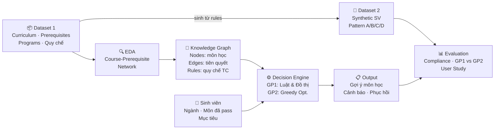

# Hướng Nghiên cứu Đồ án — DDSwithData

**Bối cảnh**: Data bảng điểm SV thực tế khó thu thập (NDA). Cần tìm hướng đồ án tận dụng data đã có: curriculum structure, course prerequisites, program rules (K2012–K2026, 9 ngành UIT).

**Môn học**: Data-Driven Decision Support (DDS) — yêu cầu: dữ liệu thật + mô hình ra quyết định + output hỗ trợ quyết định cho user cụ thể.

**Ngày research**: 2026-06-08  
**Cập nhật**: 2026-06-13 — Chốt Hướng 2 (KG + Recommendation). Synthetic data dùng để **kiểm thử/validate** hệ thống, không dùng để train ML model.

---

## Hướng đã chốt

**Hướng 2: Knowledge Graph + Learning Path Recommendation**
- Dataset 1 (thật): Curriculum structure, prerequisites, program rules (đã có)
- Dataset 2 (synthetic): Bảng điểm SV giả lập dùng để test/evaluate hệ thống gợi ý

---

## ✅ Hướng 2: Knowledge Graph + Learning Path Recommendation

> **Hướng chính của đồ án** — Decision rõ, Data thật, Output giải thích được, User là sinh viên

Build Knowledge Graph từ curriculum data → recommend lộ trình học dựa trên **vị trí hiện tại của SV trong graph**. Explainable vì dựa trên cấu trúc graph, không cần điểm số thật.

### Thiết kế hệ thống DSS

```
Input:  ngành + khóa + danh sách môn đã pass (SV tự nhập)
   ↓
Knowledge Graph:
  Nodes  — môn học, knowledge blocks
  Edges  — tiên quyết (hard), học trước (soft), cùng khối, tương đương
   ↓
Decision Engine:
  • Lọc môn hợp lệ (thỏa tiên quyết, chưa học)
  • Xếp hạng theo: unlock nhiều môn nhất / cân bằng tín chỉ / gần tốt nghiệp
  • Kiểm tra ràng buộc quy chế (≤ 25 TC/kỳ, cảnh báo học vụ)
   ↓
Output: danh sách môn gợi ý + lý do cụ thể (explainable)
  Ví dụ: "IT002 — tiên quyết thỏa, unlock 4 môn chuyên ngành sau"
User:   Sinh viên ra quyết định đăng ký học phần
```

### Có thể làm với data UIT

- Build KG từ `course_prerequisites_catalog.json` + `data/rules/local/` + `data/programs/`
- Thêm edges "tương đương" từ trường `equivalent_ids` trong `course_catalog.csv`
- Tích hợp rules từ `quy_che_790_2022.json` (credit limit, warning threshold)

### Papers tham khảo

| Paper | Năm | Journal/Venue | Link |
|-------|-----|---------------|------|
| A Knowledge Graph-Based Approach for Personalized Course and Curriculum Path Recommendation | 2025 | Springer | [link](https://link.springer.com/chapter/10.1007/978-981-95-5009-8_20) |
| Simulation of personalized learning path recommendation based on KG and deep reinforcement learning | 2025 | Scientific Reports (Nature) | [link](https://www.nature.com/articles/s41598-025-17918-x) |
| An explainable graph-based course recommendation model based on multiple interest factors | 2024 | Expert Systems with Applications (ScienceDirect) | [link](https://www.sciencedirect.com/science/article/abs/pii/S0957417424027568) |
| ACE: AI-Assisted Construction of Educational KG with Prerequisite Relations | 2024 | Journal of Educational Data Mining | [link](https://jedm.educationaldatamining.org/index.php/JEDM/article/view/737) |
| A systematic literature review of knowledge graph construction in education | 2024 | Heliyon (ScienceDirect) | [link](https://www.sciencedirect.com/science/article/pii/S2405844024014142) |
| EGRec: a MOOCs course recommendation model based on knowledge graphs | 2025 | Discover Applied Sciences (Springer) | [link](https://link.springer.com/article/10.1007/s42452-025-07131-w) |

---

## ⭐ Cấu trúc Đồ án DDS (đã chốt)

### Pipeline tổng quan



**Vai trò của synthetic data trong đồ án này:**
- Không phải training data cho ML
- Là **test cases** có ground truth → đo được rule compliance, coverage, so sánh GP1 vs GP2
- Hợp lệ vì frame là "simulation-based evaluation" — chuẩn trong DSS research

---

## Data Đã Có vs Cần Thêm

| Data | Trạng thái | Ghi chú |
|------|-----------|---------|
| Course catalog (~400 môn) | ✅ Đã có | `data/raw/course_catalog.csv` |
| Prerequisites (hard/soft) | ✅ Đã có | `data/rules/global/course_prerequisites_catalog.json` |
| Program structure (15 khóa × 9 ngành) | ✅ Đã có | `data/programs/` |
| Quy chế học vụ (790/2022) | ✅ Đã có | `data/rules/global/quy_che_790_2022.json` |
| Bảng điểm SV thực tế | ❌ Không dùng | NDA — không thu thập, không cần cho H2 |
| Synthetic transcripts (test cases) | 🔧 Cần sinh | Dùng rules UIT → test/evaluate hệ thống, không train ML |
