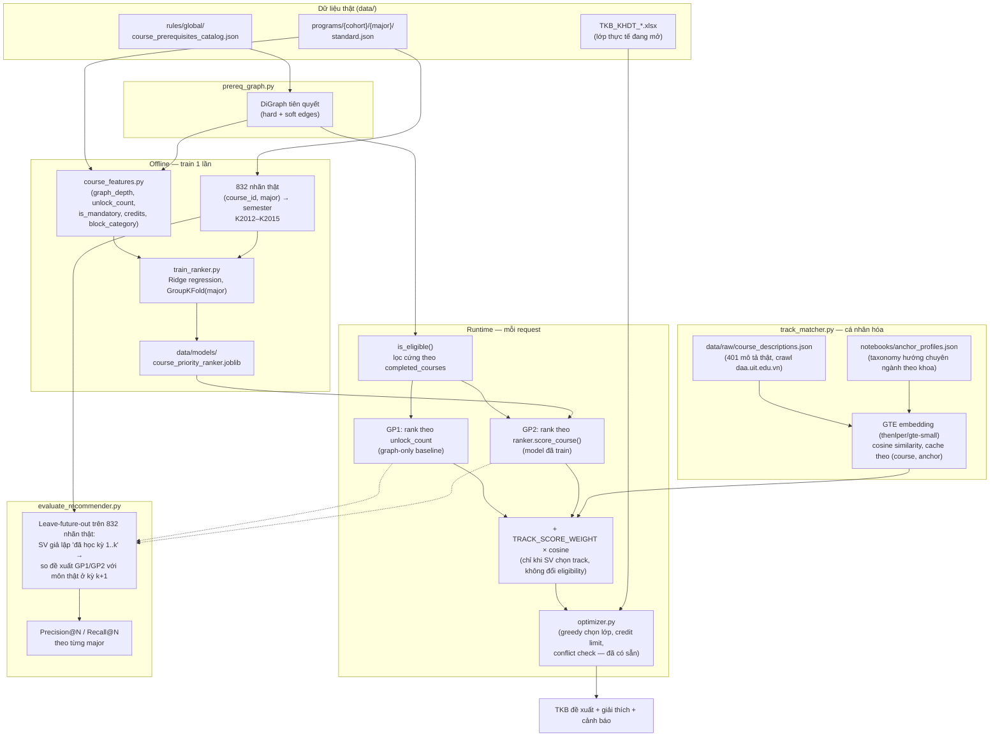

# System Design — Course Recommendation Engine

**Trạng thái:** Đã implement (GP1/GP2 engine + GTE track-weighting) trên branch `dangnh`, verify end-to-end (Docker container thật, model thật, regression test thật).
**Liên quan:** [research_directions.md](research_directions.md) (bối cảnh & hướng nghiên cứu đã chọn), [schemas/extraction_pipeline.md](schemas/extraction_pipeline.md) (pipeline sinh rule từ PDF).

---

## 1. Mental model

> Cho một sinh viên cụ thể (ngành, khóa, các môn đã hoàn thành) tại một học kỳ cụ thể (có danh sách lớp thực tế đang mở), hệ thống đề xuất **tổ hợp lớp học phần cụ thể** nên đăng ký, tối ưu theo tiến độ tốt nghiệp, đảm bảo tuân thủ 100% quy chế.

Kiến trúc 2 tầng:

```
Tầng 1 — CHỌN MÔN (What)              Tầng 2 — CHỌN LỚP (How)
KG tiên quyết + GP1/GP2 ranking  →    CSP trên TKB_KHDT thật
        ↓                                      ↓
  Danh sách môn nên học kỳ này    →    Lớp cụ thể, conflict-free,
  (đã lọc đủ tiên quyết)                trong trần tín chỉ quy chế
```

**Nguyên tắc thiết kế:** toàn bộ pipeline chỉ dùng dữ liệu thật đã có sẵn trong `data/` — không dùng bảng điểm SV thật (NDA), không dùng synthetic transcript. Phần "học" (GP2) dùng chính `semester` field thật trong khung CTĐT do trường công bố (K2012–K2015) làm nhãn giám sát.

---

## 2. Input / Output

### Input

| Nhóm | Trường | Nguồn |
|---|---|---|
| Hồ sơ SV | ngành (`major`), khóa (`cohort`), danh sách mã môn đã pass, định hướng chuyên ngành (`track`, tùy chọn) | SV tự nhập |
| Ràng buộc | min/max tín chỉ mong muốn kỳ này, `engine` (`gp1`/`gp2`) | SV tự nhập / mặc định |
| Cung thực tế | file TKB_KHDT của kỳ đăng ký (lớp, thứ, tiết, phòng, sĩ số) | `TKB_KHDT_*.xlsx` |
| Khung CTĐT | `knowledge_blocks`, `courses`, `total_credits` theo `{cohort, major}` | `data/programs/` |
| Rule tiên quyết | `COURSE_PREREQUISITE` (hard), `COURSE_PRIOR` (soft) | `data/rules/global/course_prerequisites_catalog.json` |
| Quy chế | trần tín chỉ, cảnh báo học vụ | `data/rules/global/quy_che_790_2022.json` |

### Output

| Thành phần | Nội dung |
|---|---|
| TKB đề xuất | danh sách lớp cụ thể (mã lớp, thứ, tiết, phòng, GV), conflict-free |
| Giải thích | mỗi môn kèm lý do: tiên quyết đã thỏa, unlock N môn, `priority_score` (nếu dùng GP2) |
| Cảnh báo | vượt trần TC, thiếu lớp phù hợp lịch, môn bị chặn do thiếu tiên quyết |

---

## 3. Pipeline tổng quan



---

## 4. Model

### GP1 — Rule & Graph (baseline)
Không train. Ưu tiên môn theo `unlock_count` (số môn hậu duệ trực tiếp/gián tiếp trong đồ thị tiên quyết) — proxy cho "critical path". Thay thế heuristic "sort theo credit tăng dần" của optimizer gốc.

### GP2 — Learning-to-Rank

| | |
|---|---|
| Task | Dự đoán `semester` kỳ vọng của môn → suy ra priority score |
| Label | `semester` thật, K2012–K2015 × 7 ngành = 832 dòng |
| Feature | `graph_depth`, `unlock_count`, `is_mandatory`, `credits`, `block_category` |
| Model | `sklearn.linear_model.Ridge` (giải thích được qua hệ số) |
| Split | `GroupKFold` theo `major` (bắt buộc — các khóa K2012–K2015 gần như trùng khung CTĐT, split theo cohort sẽ leak) |
| Inference | Áp cho khóa/ngành không có label thật (K2019+) dựa trên feature |

### Track-weighting — cá nhân hóa theo định hướng chuyên ngành (Phase 2, đã implement)

SV chọn ngành + 1 "hướng" (VD `KHMT` + `computer_vision`) → mỗi môn ứng viên được cộng thêm `TRACK_SCORE_WEIGHT (2.0) × cosine_similarity(embedding_môn, embedding_hướng)` vào priority score sẵn có của GP1 hoặc GP2 — **chỉ ảnh hưởng thứ tự xếp hạng trong tập môn đã đủ điều kiện tiên quyết**, không đổi phần lọc cứng. Embedding dùng model GTE (`thenlper/gte-small`, giống hướng tiếp cận của paper Scholar Inbox), tính trên mô tả môn thật (401 môn, crawl từ daa.uit.edu.vn) — cache theo `(course_id, major, anchor)`, không tính lại mỗi request. Ngành chưa có taxonomy hướng (`notebooks/anchor_profiles.json`) trả về điểm trung tính 0.0, không lỗi.

---

## 5. Đánh giá

Không dùng synthetic data, không cần user thật thử — dùng chính 832 nhãn thật làm test set qua **leave-future-out**: giả lập SV đã hoàn thành mọi môn có `semester < k` (theo khung chuẩn thật), so top-N đề xuất của GP1/GP2 với tập môn thật ở kỳ `k`. Bổ sung: formal rule-compliance check (100% output thỏa tiên quyết/tín chỉ), regression test trên 4 case tay (`scripts/test_optimizer_cases.py`), và (tùy thời gian) expert review nhỏ với cố vấn học tập.

**Kết quả hiện tại** (`scripts/evaluate_recommender.py`, sau khi fix bug parse mã môn dính liền trong `course_prerequisites_catalog.json` — xem mục 8):

| | GP1 P@5 | GP1 R@5 | GP2 P@5 | GP2 R@5 |
|---|---|---|---|---|
| Macro avg (7 ngành, 182 scenario) | 0.6205 | 0.6867 | 0.6579 | 0.7198 |

GP2 vượt GP1 trên cả precision lẫn recall ở hầu hết ngành — chứng minh model học được pattern hữu ích ngoài heuristic đồ thị thuần túy. Ridge R² (GroupKFold theo major) = 0.199, hệ số `graph_depth` mạnh nhất trong 5 feature sau khi fix data (0.269, trước đó chỉ 0.025 vì graph bị hỏng cạnh "prior").

Track-weighting verify bằng `scripts/test_track_weighting.py`: chọn hướng `KHMT/computer_vision` làm cả GP1 và GP2 đổi thứ tự đề xuất môn tự chọn thật (cosine 0.85–0.94 với các môn CS liên quan thị giác máy tính), trong khi môn bị chặn tiên quyết (VD CS410 thiếu IT003) vẫn bị chặn không đổi bất kể track/engine.

---

## 6. Sản phẩm

1. Web app (FastAPI + Jinja2, kế thừa `backend/`/`frontend/` hiện có) — chọn ngành/khóa/hướng chuyên ngành + TKB kỳ hiện tại → TKB đề xuất kèm giải thích, `priority_score`, so sánh GP1/GP2
2. `scripts/train_ranker.py` + artifact `data/models/course_priority_ranker.joblib` — tái lập được
3. `scripts/evaluate_recommender.py` — bảng so sánh GP1 vs GP2 (leave-future-out)
4. `scripts/test_optimizer_cases.py`, `scripts/test_track_weighting.py` — regression test trên case thật + chứng minh track-weighting hoạt động
5. Docker image chạy được (`docker compose up --build`) — đã verify container thật, model GTE tự tải trong container lúc request đầu
6. Báo cáo/luận văn: phần thực nghiệm GP1 vs GP2 + compliance verification + track-weighting proof

---

## 7. Ánh xạ tới code (implementation)

| Thành phần | File |
|---|---|
| Đồ thị tiên quyết | `backend/app/services/prereq_graph.py` |
| Feature engineering | `backend/app/services/course_features.py` |
| Train GP2 | `scripts/train_ranker.py` |
| Serve GP2 | `backend/app/services/ranker.py` |
| Track-weighting (GTE) | `backend/app/services/track_matcher.py` |
| Model schema (`engine`, `major`, `cohort`, `track`, `priority_score`) | `backend/app/models/schedule.py` |
| Lọc tiên quyết + chọn engine ranking + blend track | `backend/app/core/optimizer.py` |
| Đánh giá GP1 vs GP2 | `scripts/evaluate_recommender.py` |
| Regression test | `scripts/test_optimizer_cases.py`, `scripts/test_track_weighting.py` |
| Sinh rule tiên quyết từ catalog | `scripts/gen_prereq_rules.py` |
| Wiring API + form data | `backend/app/api/routes.py`, `backend/app/main.py` |
| Form UI (ngành/khóa/hướng/engine) | `frontend/templates/index.html`, `frontend/static/js/app.js` |

---

## 8. Data quality fix đã áp dụng

`scripts/gen_prereq_rules.py`'s fallback regex tách mã môn dính liền (VD `"IT001IT002IT003"` trong cột `prior_ids` của `course_catalog.csv`, không có dấu phân cách) bị lỗi off-by-one: ký tự optional cuối regex ăn nhầm chữ cái đầu của mã môn kế tiếp → sinh mã hỏng như `"IT001I"`, `"T002I"`, `"T003"`. Phát hiện qua `scripts/test_optimizer_cases.py` (case 3 dùng môn `SE101` có `prior_courses` hỏng). Ảnh hưởng 133/355 rule — toàn bộ đều là `COURSE_PRIOR` (soft), không ảnh hưởng `COURSE_PREREQUISITE` (hard) nên **logic chặn tiên quyết chưa bao giờ sai**, chỉ làm nghèo tín hiệu `graph_depth`/`unlock_count` dùng cho GP1 và feature GP2. Đã fix regex + regenerate `data/rules/global/course_prerequisites_catalog.json` + retrain — cải thiện rõ rệt (xem mục 5).

---

## 9. Phạm vi & giới hạn

**Trong scope:** 1 hệ (đại học chính quy), 7 ngành có `semester` label đầy đủ (K2012–K2015) làm train/test chính cho GP2; các ngành/khóa khác dùng model để infer (không có ground truth riêng để evaluate). Track-weighting đã phủ đủ 12/12 ngành trong `notebooks/anchor_profiles.json`. Form web đã có đủ chọn ngành, khóa, hướng chuyên ngành, và engine (GP1/GP2).

**Ngoài scope (hướng mở rộng):** dự đoán độ khó/rủi ro trượt môn (cần điểm SV thật), tối ưu đa học kỳ (multi-semester planning), real-time cập nhật sĩ số lớp.
